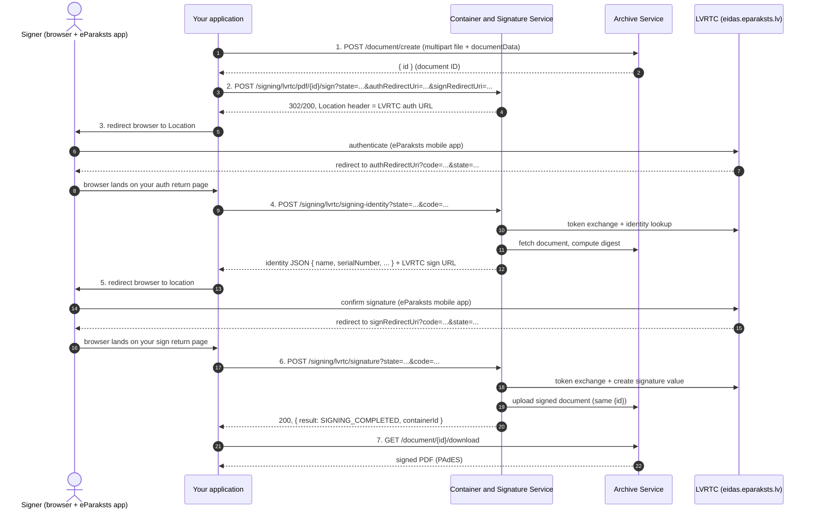

# eParaksts Mobile (ePM) Signing: Integration and Test Manual

This guide shows how to integrate **eParaksts Mobile** (ePM, the qualified mobile signature
operated by LVRTC) with the **Container & Signature Service** and the **Archive Service** of an
already-deployed **psapp-saas / PadSign** stack, which you run as containers.

It is the companion to the earlier *Smart-ID DEMO Signing: Integration and Test Manual*: the
archive side (upload, download) is identical, but the signing flow is different. Smart-ID is a
push-and-poll flow; eParaksts Mobile is a **browser redirect flow**. Your application drives it
end to end:

1. Add a PDF to the archive and receive a document ID.
2. Start ePM signing for that document and receive an LVRTC authentication URL.
3. Send the signer's browser to that URL. After the signer authenticates in the eParaksts
   mobile app, LVRTC redirects the browser back to your return page with `code` and `state`.
4. Exchange that code: the service returns the signer's identity and a second LVRTC URL, the
   signing confirmation page.
5. Send the browser there. After the signer confirms the signature, LVRTC redirects back to
   your return page with a second `code` and `state`.
6. Finalize the signature with that second code.
7. Download the signed document from the archive.

So the typical "button in your system" scenario is: the user presses *Sign*, your back end does
steps 1-2 in the background, your front end performs the two browser redirects (steps 3 and 5),
your back end does the two exchanges (steps 4 and 6) from the return pages, and the signed PDF
is waiting in the archive at the end.

The manual focuses on PDF (PAdES) signing with the `/pdf/{id}/sign` endpoint. Signing existing
ASiC-E containers and batch signing use sibling endpoints, mentioned in
[Step 2](#step-2-start-epm-signing).

Code examples are JavaScript (Node 18+, which provides global `fetch`, `FormData`, and `Blob`).

> **About the examples.** Unlike the Smart-ID manual, the full cycle shown here was not captured
> from a live run: driving ePM end to end requires an LVRTC integration contract (client ID,
> secret, and registered redirect URIs), which is deployment-specific. Endpoint paths, parameter
> names, and response fields were verified against the Container & Signature Service
> implementation (release line 24.3.0.x), and the start and status endpoints were additionally
> exercised live against a reference deployment on 24.3.0.29. One transport detail changed
> inside that release line (a `302` became a `200` in version 24.3.0.56); both variants are
> documented where they differ. Use the [test kit](test/) to validate the full cycle on your own
> environment once your LVRTC credentials are configured.

---

## Contents

1. [Scope and audience](#1-scope-and-audience)
2. [Components involved](#2-components-involved)
3. [How the redirect flow works](#3-how-the-redirect-flow-works)
4. [Prerequisites](#4-prerequisites)
5. [Base URLs and environment variables](#5-base-urls-and-environment-variables)
6. [Authentication](#6-authentication)
7. [One-time service configuration](#7-one-time-service-configuration)
8. [Step-by-step API reference](#8-step-by-step-api-reference)
9. [Start-request parameters](#9-start-request-parameters)
10. [Signing result states](#10-signing-result-states)
11. [End-to-end test](#11-end-to-end-test)
12. [Troubleshooting](#12-troubleshooting)
13. [Notes for production](#13-notes-for-production)
- [Appendix A. Endpoint quick reference](#appendix-a-endpoint-quick-reference)
- [Appendix B. Glossary](#appendix-b-glossary)

---

## 1. Scope and audience

- **Audience:** back-end and front-end engineers integrating eParaksts Mobile signing into
  their own system, plus the administrator who applies the one-time service configuration.
- **Assumption:** the psapp-saas stack is already deployed and reachable. That is, the
  Container & Signature Service and the Archive Service containers are running and exposed (by
  default behind the platform reverse proxy under `/container/api` and `/archive/api`).
- **Goal:** drive a full eParaksts Mobile signing cycle from your own application, and know
  exactly what must be configured (on the service and with LVRTC) before it works.
- **Not covered:** the PadSign portal and its tablet signing flow. This manual is about your
  application calling the signing API directly, the same "pure API" approach as the Smart-ID
  manual.
- **About concrete values:** service ports, the `DMSSDoc` document type, and file names of the
  configuration files come from a reference PadSign delivery. The configuration files referenced
  below (`application.yml`, `mappings.json`) are part of your ps-app delivery, so you can inspect
  and edit them directly. Substitute your own deployment's values.

---

## 2. Components involved

| Component | Role in this flow | Default service port | Reverse-proxy path |
|---|---|---|---|
| **Your application** | Hosts the *Sign* button, performs the two browser redirects, hosts the two return pages, calls the APIs | - | - |
| **Archive Service** | Stores the PDF, mints the document ID, returns the signed file | `8090` | `/archive/api` |
| **Container & Signature Service** | Runs the ePM signing flow: builds the LVRTC URLs, exchanges the OAuth codes, computes the document digest, assembles the PAdES signature, writes the signed file back to the archive | `8092` | `/container/api` |
| **LVRTC / eParaksts** | The qualified trust service provider: authenticates the signer in the eParaksts mobile app and produces the signature value | (external) | external host (`eidas.eparaksts.lv`) |

The Container & Signature Service (the Container Service from here on) fetches the document
from the archive using the document ID you pass in step 2, signs it, and uploads the signed
version back to the archive under the same document ID. So the ID returned in step 1 is the
single handle for the whole cycle, exactly as in the Smart-ID flow.

One thing the Container Service does **not** do: it never sees the signer's browser. All
browser navigation (to LVRTC and back) happens between the signer, LVRTC, and your application.
The service only builds the URLs and consumes the codes your application brings back.

---

## 3. How the redirect flow works

Under the hood this is OAuth 2.0 authorization code, run twice against LVRTC's authorization
server: once with the authentication + identity scopes (who is signing), and once with the
signing scope (confirm this digest). The Container Service hides the token exchanges and digest
mathematics from you; your application only moves the browser and passes `code` + `state` pairs
to the service.



Three things to internalize before writing code:

- **Turn off redirect-following in your HTTP client for the signing calls.** The service hands
  you the next LVRTC URL in the `Location` response header. On service versions up to
  24.3.0.49 (the line shipped with current PadSign deliveries) the status code is a real
  `302 Found`; from 24.3.0.56 it is `200 OK` with the same header. Either way the redirect is
  for the **signer's browser**, not for your back end: an HTTP client that auto-follows (the
  default in most libraries, including `fetch`) would silently walk into the LVRTC login page
  and hand you HTML instead of headers. Read the `Location` header yourself and send the
  browser there.
- **`state` is the session key.** The same `state` value identifies the signing session across
  all six steps. Supply your own (a fresh random UUID per signing) and you never have to fish
  it out of the response; otherwise the service generates one and returns it in the start
  response (`sessionId` in the JSON body up to 24.3.0.49, the `session-id` header from
  24.3.0.56). Your return pages should check that the `state` coming back from LVRTC matches
  the one you started with, and reject mismatches.
- **The session lives for 10 minutes.** The signing session is held in the service's in-memory
  cache with a 10-minute expiry (configurable via `hazelcast.expireInminutes`). The signer must
  complete both LVRTC rounds within that window, otherwise steps 4 or 6 return `401` and the
  cycle must be restarted from step 2.

---

## 4. Prerequisites

**An LVRTC integration contract.** eParaksts Mobile is a contracted service. Before anything
works you need, from LVRTC (arranged during onboarding, together with TrustLynx where
applicable):

| Item | Used as |
|---|---|
| Client ID | `lvrtc.clientId` in the service configuration |
| Client secret | `lvrtc.clientSecret` in the service configuration |
| Registered redirect URI(s) | The exact HTTPS URLs of your return pages; LVRTC only redirects to pre-registered URIs |
| Access to the LVRTC integration environment | Test credentials and environment details come with the agreement |

The starting point for the LVRTC side is the eParaksts integration platform documentation:
<https://wiki.eparaksts.lv/display/SP/%28ENG%29+Integration+platform>.

**Registered redirect URIs.** Decide the URLs of your two return pages up front (they can be
the same page; see [Step 3](#step-3-send-the-browser-to-lvrtc-authentication)) and register
them with LVRTC. A redirect URI that is not registered, or that differs by so much as a
trailing slash, makes LVRTC refuse the authorization request or the service's token exchange
fail with `401`.

**Services are up.** Each service answers `GET /ping` with `pong` on its service port:

```js
await fetch("http://<container-host>:8092/ping"); // -> 200 "pong"
await fetch("http://<archive-host>:8090/ping");   // -> 200 "pong"
```

**Outbound connectivity from the Container Service.** The service (not your client, not the
browser) calls LVRTC's back-end endpoints during steps 4 and 6, and the timestamping service
while assembling the LT-level signature. The host running it must be able to reach:

| Purpose | Host |
|---|---|
| LVRTC OAuth + signing API | `https://eidas.eparaksts.lv` (443) |
| eParaksts timestamp authority (TSA) | `https://tsa.eparaksts.lv` (443) |
| OCSP / revocation and trust lists | per the certificate AIA URLs and the EU/national TSL |

If the host reaches the internet through an outbound proxy, configure the JVM proxy settings on
the Container Service. A blocked TSA or OCSP host is the usual cause of a `SIGNING_FAILED`
after an otherwise successful confirmation.

**The signer needs eParaksts Mobile.** An activated eParaksts Mobile account on the signer's
phone. There is no auto-confirming test account in the Smart-ID sense; even in the LVRTC test
environment a human confirms each round in the app.

**A signer-facing browser context.** Because this is a redirect flow, signing cannot run fully
headless. The signer's browser session must be able to reach LVRTC and your return pages.

---

## 5. Base URLs and environment variables

Set these to match your deployment. The examples below reuse them:

```js
// Set these to match your deployment.
const ARCHIVE_BASE   = "https://<your-host>/archive/api";   // or http://<archive-host>:8090/api
const CONTAINER_BASE = "https://<your-host>/container/api"; // or http://<container-host>:8092/api

// Your return pages, exactly as registered with LVRTC (may be the same URL).
const AUTH_RETURN_URL = "https://<your-app>/epm/return/auth";
const SIGN_RETURN_URL = "https://<your-app>/epm/return/sign";

// Optional: set only if the archive enforces JWT (see section 6)
const TOKEN = "";
const authHeaders = TOKEN ? { Authorization: `Bearer ${TOKEN}` } : {};
```

All endpoint paths below are written relative to `ARCHIVE_BASE` and `CONTAINER_BASE`.

> If the reverse proxy uses a self-signed or internal certificate, trust the CA on the calling
> host (Node respects `NODE_EXTRA_CA_CERTS=/path/to/ca.pem`) so the TLS handshake succeeds.
> Note this applies to your API calls only; LVRTC-facing URLs must carry a publicly trusted
> certificate anyway, because the signer's browser visits them.

---

## 6. Authentication

**Default ps-app delivery: no token is required.** As delivered, the Archive Service runs with
JWT authentication disabled, the Container Service applies no authentication of its own, and
the reverse proxy adds none on `/archive/api` or `/container/api`. So the full signing cycle
works with no `Authorization` header.

You only need a token if your deployment has explicitly enabled archive JWT
(`authentication.jwt.enabled: true` in the archive's `application.yml`). In that case send the
same `Authorization: Bearer <token>` on the upload and download calls **and** on the signing
calls (steps 2, 4 and 6): the Container Service forwards your headers to the archive when it
fetches the document and computes the digest. Get a token the same way as in the Smart-ID
manual (Keycloak `client_credentials` against your realm).

The `403` you can meet on the signing endpoints is not an authentication failure of yours: an
empty-body `403` from any `/signing/lvrtc/*` endpoint means the service itself has no
`lvrtc.clientId` configured (see [section 7](#7-one-time-service-configuration)).

---

## 7. One-time service configuration

The ePM settings live in the Container Service's `application.yml` (part of your ps-app
delivery, bind-mounted into the container). The delivery ships the block with placeholder
values; signing stays disabled (`403`) until real ones are set:

```yaml
# Container Service application.yml
lvrtc:
  baseUri: https://eidas.eparaksts.lv/          # LVRTC environment (test env URL comes with your agreement)
  clientId: <your-LVRTC-client-id>              # from the LVRTC contract
  clientSecret: <your-LVRTC-client-secret>      # from the LVRTC contract
  authRedirectUri: https://<your-app>/epm/return/auth   # default return page, leg 1 (registered with LVRTC)
  signRedirectUri: https://<your-app>/epm/return/sign   # default return page, leg 2 (registered with LVRTC)
  defaultLocale: lv                             # LVRTC page language: lv, en, or ru
  tspUrl: https://tsa.eparaksts.lv/             # eParaksts timestamp authority
```

Notes:

- `authRedirectUri` / `signRedirectUri` here are only **defaults**. Your application can
  override them per signing request (see [section 9](#9-start-request-parameters)); every value
  used must be registered with LVRTC either way. If your application always passes its own,
  the configured defaults are effectively documentation.
- The delivery's placeholder block points the redirect URIs at a TrustLynx demo portal. Replace
  them; they are meaningless for your deployment.
- The same file also carries keystore settings under `lvrtc:` (used where LVRTC requires
  client-certificate authentication, for example towards the timestamping service). Defaults
  are baked into the image; production values, where needed, are part of LVRTC onboarding.
- After editing, restart the container so Spring re-reads the file:

```bash
docker compose restart dmss-container-and-signature-services
```

A quick way to confirm the switch: any `/signing/lvrtc/*` endpoint stops returning the empty
`403` once `clientId` is non-empty. For example
`GET {CONTAINER_BASE}/signing/lvrtc/session/probe/status` returns `403` while unconfigured, and
`422 {"result":"Signing session not found"}` once configured (verified live; the probe session
does not exist, which is exactly the point).

---

## 8. Step-by-step API reference

> The snippets below run in order and reuse variables: Step 1 produces `docId`, Step 2 produces
> `state` and the auth URL, steps 4-7 reuse them. They assume the constants from
> [section 5](#5-base-urls-and-environment-variables). For brevity they omit response-status
> checks and request timeouts; the [test kit](test/) is the validating version.

### Step 1. Add a PDF, receive a document ID

Identical to the Smart-ID manual. Summarized here so this manual stands alone:

| | |
|---|---|
| **Method** | `POST` |
| **URL** | `{ARCHIVE_BASE}/document/create?documentData=<url-encoded JSON>` |
| **Content-Type** | `multipart/form-data`, part `file` with the PDF bytes |
| **Auth** | Bearer token only if the archive enforces JWT (see [section 6](#6-authentication)) |

```js
import { readFile } from "node:fs/promises";

const documentData = JSON.stringify({
  documentFilename: "contract.pdf",
  objectName: "contract.pdf",
  documentType: "DMSSDoc", // must exist in the archive's mappings.json
});

const form = new FormData();
form.append("file", new Blob([await readFile("contract.pdf")], { type: "application/pdf" }), "contract.pdf");

const res = await fetch(
  `${ARCHIVE_BASE}/document/create?documentData=${encodeURIComponent(documentData)}`,
  { method: "POST", headers: authHeaders, body: form }
);
const { id: docId } = await res.json();
```

Success returns `{ "id": "<uuid>", ... }`; `id` is the document ID used everywhere below.

---

### Step 2. Start ePM signing

| | |
|---|---|
| **Method** | `POST` |
| **URL** | `{CONTAINER_BASE}/signing/lvrtc/pdf/{id}/sign?<params>` |
| **Body** | optional JSON (visible-signature attributes; omit for an invisible signature) |
| **Response** | up to 24.3.0.49: `302 Found`, `Location` header (LVRTC auth URL), JSON body `{ "sessionId": "<state>" }`. From 24.3.0.56: `200 OK`, `Location` and `session-id` headers, empty body |

All inputs are query parameters (full list in [section 9](#9-start-request-parameters)). Either
way the LVRTC auth URL is in the `Location` header, so with redirect-following disabled the
same client code handles both versions. A typical start:

```js
import { randomUUID } from "node:crypto";

const state = randomUUID(); // your session key; keep it server-side per signing

const params = new URLSearchParams({
  state,
  locale: "lv",
  authRedirectUri: AUTH_RETURN_URL,
  signRedirectUri: SIGN_RETURN_URL,
  acrValues: "urn:eparaksts:authentication:flow:mobileid",
});

const res = await fetch(
  `${CONTAINER_BASE}/signing/lvrtc/pdf/${encodeURIComponent(docId)}/sign?${params}`,
  { method: "POST", headers: authHeaders, redirect: "manual" } // do NOT follow the 302
);

const authUrl = res.headers.get("location"); // LVRTC authentication URL
// state to use onward: the one you supplied above
```

Verified live against a 24.3.0.29 deployment: the call answers `302` with the `Location`
header carrying exactly the URL shape shown below, and echoes the supplied `state` and
`acrValues` into it.

The returned `Location` is the LVRTC authorization URL, of this shape (all built by the
service; shown so you recognize it in logs):

```
https://eidas.eparaksts.lv/trustedx-authserver/oauth/lvrtc-eipsign-as
  ?client_id=<lvrtc.clientId>
  &redirect_uri=<authRedirectUri>
  &response_type=code
  &state=<state>
  &scope=urn:lvrtc:fpeil:aa urn:safelayer:eidas:sign:identity:profile urn:safelayer:eidas:sign:identity:use:server
  &approval_prompt=auto
  &ui_locales=lv
  &acr_values=urn:eparaksts:authentication:flow:mobileid
```

- `403` (empty body) means the service has no LVRTC client ID configured
  (see [section 7](#7-one-time-service-configuration)).
- Pass `authRedirectUri` and `signRedirectUri` **together or not at all**. Supplying only one
  of them leaves the other empty in the session, and the second token exchange then runs with
  an empty redirect URI and fails with `401`.

**Signing other document shapes.** The same flow (identical steps 3-7) is also available on:

- `POST {CONTAINER_BASE}/signing/lvrtc/document/{id}/sign` - same parameters; the service
  detects the stored document's type and routes automatically (PDF to PAdES, ASiC-E to
  container signing).
- `POST {CONTAINER_BASE}/signing/lvrtc/container/{id}/sign` - signs an existing ASiC-E
  container (no request body).
- `POST {CONTAINER_BASE}/signing/lvrtc/document/batch/sign` - signs several archive documents
  in one ePM session. Requires a JSON body
  `{ "documents": ["<id1>", "<id2>", ...], "pdfSigner": { ... } }`. Note two batch
  differences: the service always generates the session ID itself (your `state` query
  parameter is ignored, read the session ID from the start response as described above), and
  the finalize call in step 6 returns immediately with `SIGNING_IN_PROGRESS`, so completion is
  confirmed by polling (step 6a).

---

### Step 3. Send the browser to LVRTC (authentication)

Redirect the signer's browser to the `Location` URL from step 2 (HTTP redirect,
`window.location`, or a link - whatever fits your UI). The signer authenticates with their
eParaksts Mobile app (phone confirmation).

LVRTC then redirects the browser to your `authRedirectUri`:

```
https://<your-app>/epm/return/auth?code=<one-time-code>&state=<state>
```

Your return page hands `code` and `state` to your back end for step 4. Two rules:

- **Verify `state`** matches a signing you actually started, and drop the request otherwise.
- **Use the code immediately.** Authorization codes are one-time and short-lived.

If the signer cancels or authentication fails, LVRTC redirects back with an `error` parameter
instead of `code`. Treat that as a terminal outcome for this session and surface a message to
the user; a new attempt starts again from step 2.

> The two return pages may be one and the same URL: the flow's `state` tells you which signing
> session the callback belongs to, and your own session bookkeeping tells you whether you are
> on leg 1 or leg 2. Registering a single return URL with LVRTC keeps the contract simpler.

---

### Step 4. Exchange the auth code: identity + signing URL

| | |
|---|---|
| **Method** | `POST` |
| **URL** | `{CONTAINER_BASE}/signing/lvrtc/signing-identity?state=<state>&code=<code>` |
| **Response** | up to 24.3.0.49: `302 Found`, sign URL in the `Location` header, identity JSON in the body. From 24.3.0.56: `200 OK`, identity JSON with the sign URL as a `location` field |

```js
const res = await fetch(
  `${CONTAINER_BASE}/signing/lvrtc/signing-identity?` +
    new URLSearchParams({ state, code: authCode }),
  { method: "POST", headers: authHeaders, redirect: "manual" } // do NOT follow the 302
);
const identity = await res.json();
// Sign URL: JSON field on 24.3.0.56+, Location header on earlier versions.
const signUrl = identity.location || res.headers.get("location");
```

Behind this one call the service exchanges the code for an access token, reads the signer's
identity from LVRTC, selects the signing identity, fetches your document from the archive, and
computes the digest that will be signed. The identity JSON:

```json
{
  "sessionId": "<state>",
  "name": "JĀNIS BĒRZIŅŠ",
  "givenName": "JĀNIS",
  "familyName": "BĒRZIŅŠ",
  "serialNumber": "PNOLV-123456-78901",
  "eips": "...",
  "location": "https://eidas.eparaksts.lv/trustedx-authserver/oauth/lvrtc-eipsign-as?...&sign_identity_id=...&digests_summary=...&digests_summary_algorithm=SHA256"
}
```

(`location` present from 24.3.0.56; on earlier versions take the same URL from the `Location`
response header instead. Earlier versions may also include additional technical fields in the
body; ignore anything not listed here.)

- The identity fields let you check **who is about to sign** before the signature happens. If
  your process expects a specific person (for example, the customer whose contract this is),
  compare `serialNumber` (which carries the personal code) here and abort politely on mismatch,
  rather than after a signature exists.
- The sign URL is the second LVRTC URL, the signing confirmation page. It is bound to this
  document's digest (the `digests_summary` parameter), so it cannot be reused for another
  document.
- `401` here means the code exchange or identity lookup failed: expired/reused code, `state`
  unknown (session expired, see the 10-minute rule), or redirect-URI mismatch against the
  LVRTC registration.

---

### Step 5. Send the browser to LVRTC (signing confirmation)

Redirect the signer's browser to the sign URL from step 4. The signer reviews and confirms the
signature in the eParaksts Mobile app. LVRTC redirects the browser to your `signRedirectUri`:

```
https://<your-app>/epm/return/sign?code=<one-time-code>&state=<state>
```

Same rules as step 3: verify `state`, use the code immediately, handle the `error` parameter.
Refusing the signature in the app surfaces here as an error redirect, not as an API failure.

---

### Step 6. Finalize the signature

| | |
|---|---|
| **Method** | `POST` |
| **URL** | `{CONTAINER_BASE}/signing/lvrtc/signature?state=<state>&code=<code>` |
| **Response** | `200 OK`, JSON |

```js
const res = await fetch(
  `${CONTAINER_BASE}/signing/lvrtc/signature?` +
    new URLSearchParams({ state, code: signCode }),
  { method: "POST", headers: authHeaders }
);
const outcome = await res.json();
```

The service exchanges the second code, has LVRTC produce the signature value over the prepared
digest, assembles the PAdES signature (timestamp and revocation data included at LT level), and
uploads the signed document back to the archive under the same document ID.

For a **single document** the call waits for completion (up to 60 seconds) and returns the
terminal result:

```json
{
  "result": "SIGNING_COMPLETED",
  "sessionId": "<state>",
  "containerId": "<document ID>"
}
```

If 60 seconds pass without completion, or for **batch** signing always, the response says
`SIGNING_IN_PROGRESS` (with `containers` listing the document IDs in the batch case) and you
confirm completion by polling:

#### Step 6a. Poll the session status (when needed)

| | |
|---|---|
| **Method** | `GET` |
| **URL** | `{CONTAINER_BASE}/signing/lvrtc/session/{state}/status` |

```js
let result;
do {
  await new Promise((r) => setTimeout(r, 2000));
  const res = await fetch(
    `${CONTAINER_BASE}/signing/lvrtc/session/${encodeURIComponent(state)}/status`,
    { headers: authHeaders }
  );
  result = (await res.json()).result;
} while (result === "SIGNING_IN_PROGRESS" || result === "SIGNING_STARTED");
// result is now SIGNING_COMPLETED or an error state (section 10)
```

Unlike the Smart-ID status endpoint, there is no long-poll variant here; poll at a modest
interval. In the common single-document case you rarely need this at all, because step 6
already blocks until the result.

- If you started the signing with `additionalData=<your-correlation-value>`, it comes back in
  the step 6 response, which helps stateless return-page handlers re-associate the outcome.

---

### Step 7. Download the signed document

Identical to the Smart-ID manual:

| | |
|---|---|
| **Method** | `GET` |
| **URL** | `{ARCHIVE_BASE}/document/{id}/download` |
| **Response** | Binary PDF with the embedded PAdES signature |

```js
import { writeFile } from "node:fs/promises";

const res = await fetch(`${ARCHIVE_BASE}/document/${docId}/download`, { headers: authHeaders });
await writeFile("signed.pdf", Buffer.from(await res.arrayBuffer()));
```

The default signature level in the reference delivery is PAdES-BASELINE-LT (timestamp from
`tsa.eparaksts.lv` plus OCSP data embedded), so the file validates long-term, for example in
eParaksts validation tools.

---

## 9. Start-request parameters

Query parameters accepted by all start endpoints (`/pdf/{id}/sign`, `/document/{id}/sign`,
`/container/{id}/sign`, `/document/batch/sign`):

| Parameter | Required | Default | Meaning |
|---|---|---|---|
| `state` | no | generated UUID | Session key for the whole cycle. Supply your own random UUID to correlate callbacks with your records, or read the generated one from the start response (JSON `sessionId` up to 24.3.0.49, `session-id` header from 24.3.0.56). Ignored by `batch/sign` (always generated). |
| `authRedirectUri` | no | `lvrtc.authRedirectUri` from config | Return URL for the authentication leg. Must be registered with LVRTC. |
| `signRedirectUri` | no | `lvrtc.signRedirectUri` from config | Return URL for the signing leg. Must be registered with LVRTC. Pass together with `authRedirectUri` or not at all. |
| `locale` | no | `lvrtc.defaultLocale` (`lv`) | Language of the LVRTC pages: `lv`, `en`, or `ru`. |
| `acrValues` | no | service configuration | Authentication method hint. Use `urn:eparaksts:authentication:flow:mobileid` for eParaksts Mobile (recommended to pass explicitly); `urn:eparaksts:authentication:flow:sc_plugin` selects the eID smart-card flow instead. |
| `signatureProfile` | no | `LT` | Signature level for ASiC-E container signing (`B`, `T`, `LT`, `LTA`). For PDF signing the level comes from the service default (PAdES-BASELINE-LT) or the request body's `signatureProfile` (for example `PAdES_BASELINE_B`). |
| `role` | no | empty | Signer role text embedded in the signature. |
| `additionalData` | no | - | Opaque correlation value echoed back in the step 6 response. |

Optional extras:

- **Request body** (`/pdf/{id}/sign` and `/document/{id}/sign`): the same visible-signature
  attributes as in the Smart-ID manual's request body, for example
  `{ "pdfSignatureIsVisible": true, "signatureReason": "...", "signatureLocation": "...", "signatureContactInfo": "..." }`.
  Omit the body entirely for an invisible signature.
- **`notifyid` header**: if your deployment uses the platform's signing-notification mechanism,
  the value is attached to the session and passed through on finalization.

---

## 10. Signing result states

The `result` field of the step 6 response and the status endpoint:

| State | Meaning | Next action |
|---|---|---|
| `SIGNING_IN_PROGRESS` | Finalization is running (or step 6 not yet called for this session) | keep polling (step 6a) |
| `SIGNING_COMPLETED` | Document signed and stored in the archive | download (step 7) |
| `SIGNING_FAILED` | Finalization failed (LVRTC error, unreachable TSA/OCSP, archive error) | check service logs, restart from step 2 |
| `Signing session not found` (HTTP `422`) | Unknown or expired `state` on the status endpoint | restart from step 2 |

Failures **before** finalization surface differently, as HTTP codes on the API calls:

| HTTP code | Where | Meaning |
|---|---|---|
| `403` (empty body) | any `/signing/lvrtc/*` call | LVRTC client ID not configured on the service ([section 7](#7-one-time-service-configuration)) |
| `401` | steps 4 and 6 | Code exchange rejected (expired/reused code, redirect-URI mismatch) or session expired/unknown `state` |
| `error` query parameter | your return pages | The signer cancelled/refused, or LVRTC rejected the round; no code was issued |

---

## 11. End-to-end test

The [test kit](test/) drives the whole cycle from one terminal. The two browser legs cannot be
automated (a human confirms in the eParaksts app), so the script prints each LVRTC URL for you
to open and then captures the return in one of two ways: you paste the redirected URL back into
the terminal (works with any registered return page), or, if your registered return URL points
at your workstation, `--listen` catches it automatically on a local port. See
[test/README.md](test/README.md) for setup and expected output:

```
ARCHIVE_BASE="https://<your-host>/archive/api" \
CONTAINER_BASE="https://<your-host>/container/api" \
AUTH_REDIRECT_URI="https://<your-app>/epm/return/auth" \
SIGN_REDIRECT_URI="https://<your-app>/epm/return/sign" \
node test/sign-epm-demo.mjs ./test/sample.pdf
```

Expected outcome: a document ID, an LVRTC authentication URL, the signer's identity after leg
1, an LVRTC signing URL, `SIGNING_COMPLETED` after leg 2, and a downloaded `signed.pdf` with an
embedded PAdES signature.

---

## 12. Troubleshooting

| Symptom | Cause and fix |
|---|---|
| Start or `signing-identity` call returns LVRTC's HTML page instead of headers/JSON | Your HTTP client followed the `302` redirect to `eidas.eparaksts.lv`. Disable redirect-following for these calls (`redirect: "manual"` in fetch, `CURLOPT_FOLLOWLOCATION` off, etc.) and read the `Location` header. |
| `403` (empty body) on any signing call | `lvrtc.clientId` is empty on the Container Service. Configure the LVRTC block and restart ([section 7](#7-one-time-service-configuration)). |
| LVRTC shows an error instead of the login page | Redirect URI not registered with LVRTC (or differs from the registered value), or wrong `client_id`. Compare the `redirect_uri` in the `Location` URL character-for-character with the LVRTC registration. |
| `401` from `signing-identity` | Auth code expired or already used, `state` unknown (10-minute session expired), or the auth-leg redirect URI does not match between the authorize call and the LVRTC registration. Restart from step 2. |
| `401` from `signature` | Same causes on the signing leg. Also occurs when only one of `authRedirectUri` / `signRedirectUri` was passed at start ([step 2](#step-2-start-epm-signing) note). |
| Return page receives `error=...` instead of `code` | The signer cancelled or LVRTC refused the round. Show a message; a fresh attempt starts from step 2. |
| Step 6 returns `SIGNING_IN_PROGRESS` and polling never completes | Check Container Service logs. Usual causes: TSA (`tsa.eparaksts.lv`) or OCSP unreachable from the container, or an archive write failure. |
| `SIGNING_FAILED` | Terminal failure during finalization; the service log has the underlying error. Signed nothing; safe to restart from step 2. |
| `400 "Could not find mapping for document type"` on upload | `documentType` not defined in the archive's `mappings.json`. List valid types with `GET {ARCHIVE_BASE}/archiveservice/documenttypes`. |
| Download returns the unsigned file | You downloaded before `SIGNING_COMPLETED`. Wait for the terminal state, then download. |
| `401/403` from the archive | Archive enforces JWT. Send a valid `Authorization: Bearer` token on steps 1, 2, 4, 6 and 7. |
| TLS error against the reverse proxy | Self-signed or internal cert. Trust the CA on the calling host (`NODE_EXTRA_CA_CERTS`). |

---

## 13. Notes for production

- **Protect the signing API.** In the default delivery, `/container/api` (and the service's
  host port) accept unauthenticated calls. The ePM endpoints are keyed only by `state`, so
  anyone who can reach the API and knows a live `state` could interfere with a session. For
  production, restrict who can reach `/container/api` (network segmentation, reverse-proxy
  allowlist, or mTLS between your application and the platform) and keep `state` values
  server-side.
- **Treat `state` as a secret while the session lives.** Generate it with a CSPRNG (a UUID from
  `crypto.randomUUID()` is fine), never derive it from user input or document IDs, and verify
  it on every callback. The service accepts a caller-supplied `state` verbatim, so its quality
  is your responsibility.
- **Use HTTPS return pages with publicly trusted certificates.** LVRTC redirects a real user's
  browser there; also LVRTC registration requires the exact production URLs.
- **Expect and handle the 10-minute window.** Users get distracted mid-signing. Make your UI
  able to restart cleanly from step 2 when a session expires (the `401`/`SESSION_NOT_FOUND`
  paths above).
- **Verify the signer before finalizing.** The identity response of step 4 exists so your
  process can enforce *who* signs, not only *that* someone signed. A mismatch is much cheaper
  to handle before step 5 than after a qualified signature exists on the document.
- **Log `state` and document IDs, not codes.** The `code` values are one-time credentials;
  keep them out of application logs. The service itself logs mode and session information
  without credentials.
- **LVRTC environments.** Do the first integration against the LVRTC test environment from
  your agreement, then switch `lvrtc.baseUri`, credentials, and registered URIs to production
  values. The flow and endpoints are identical.

---

## Appendix A. Endpoint quick reference

| Step | Method | Path (relative to base) | Base |
|---|---|---|---|
| 1. Upload | `POST` | `/document/create?documentData=<json>` | `ARCHIVE_BASE` |
| 2. Start, PDF | `POST` | `/signing/lvrtc/pdf/{id}/sign?<params>` | `CONTAINER_BASE` |
| 2. Start, auto-detect type | `POST` | `/signing/lvrtc/document/{id}/sign?<params>` | `CONTAINER_BASE` |
| 2. Start, ASiC-E container | `POST` | `/signing/lvrtc/container/{id}/sign?<params>` | `CONTAINER_BASE` |
| 2. Start, batch | `POST` | `/signing/lvrtc/document/batch/sign?<params>` (JSON body with `documents`) | `CONTAINER_BASE` |
| 4. Identity + sign URL | `POST` | `/signing/lvrtc/signing-identity?state=&code=` | `CONTAINER_BASE` |
| 6. Finalize | `POST` | `/signing/lvrtc/signature?state=&code=` | `CONTAINER_BASE` |
| 6a. Status | `GET` | `/signing/lvrtc/session/{state}/status` | `CONTAINER_BASE` |
| 7. Download | `GET` | `/document/{id}/download` | `ARCHIVE_BASE` |
| List document types | `GET` | `/archiveservice/documenttypes` | `ARCHIVE_BASE` |

Steps 3 and 5 are browser navigations to LVRTC URLs produced by steps 2 and 4; they involve no
API call from your application.

## Appendix B. Glossary

| Term | Meaning |
|---|---|
| **eParaksts Mobile (ePM)** | LVRTC's app-based qualified electronic signature and authentication service for Latvia. |
| **LVRTC** | Latvia State Radio and Television Centre, the qualified trust service provider operating eParaksts. |
| **eIDAS** | The EU regulation on electronic identification and trust services; a qualified electronic signature under it is legally equivalent to a handwritten one. |
| **Authorization code flow** | The OAuth 2.0 pattern used here twice: browser redirect to the provider, redirect back with a one-time `code`, server-side exchange of the code. |
| **`state`** | The random value that ties the redirects to the signing session; doubles as the session key on the Container Service. |
| **Redirect / return URI** | The URL in your application that LVRTC sends the browser back to; must be pre-registered with LVRTC. |
| **acr_values** | OAuth hint selecting the authentication method (`...flow:mobileid` for eParaksts Mobile, `...flow:sc_plugin` for the eID card plugin). |
| **`digests_summary`** | Hash of the document digest(s), carried in the signing-leg URL so the signer confirms exactly this content. |
| **PAdES** | PDF Advanced Electronic Signature, a signature embedded inside the PDF. |
| **ASiC-E** | Associated Signature Container (Extended), a `.asice` ZIP holding documents plus signatures. |
| **B / T / LT / LTA** | Signature levels: basic, with timestamp, long-term (timestamp + revocation data), long-term with archival timestamps. |
| **TSA** | Time-Stamp Authority (`tsa.eparaksts.lv` for eParaksts signatures). |
| **OCSP** | Online Certificate Status Protocol, the real-time certificate revocation check embedded at LT level. |
| **Keycloak / JWT** | The platform identity server and bearer token, optionally enforced by the Archive Service. |
| **psapp-saas / PadSign** | The deployed signing platform this manual integrates with. |
